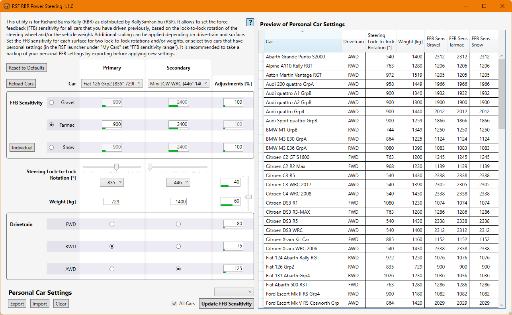

# RSF RBR Power Steering

This utility is for Richard Burns Rally (RBR) as distributed by [RallySimFan.hu (RSF)](https://rallysimfans.hu). It allows to set the force-feedback (FFB) sensitivity for all cars that you have driven previously, based on the lock-to-lock rotation of the steering wheel and/or the vehicle weight. Additional scaling can be applied depending on drive-train and surface.

## Instructions

### Prerequisites

This utility uses [.NET 8](https://dotnet.microsoft.com/en-us/download/dotnet/8.0). If it is not yet installed, the utility should let you download it on start. If this fails please refer to the link.

### Installation

Put the executable into your RSF RBR directory.

If you want to share the utility between different installations put it anywhere and refer to Usage for more details.

### Usage

Start the executable; the working directory has to be your RSF RBR directory.

For sharing the same executable between different installations you can create one shortcut to the utility per installation, setting the working directory to each installation directory respectively.

## Contribution

Reporting issues for bugs and feature requests through GitHub is appreciated. Pull requests will gladly be considered.

## License

For details see the file [`LICENSE.txt`](https://raw.githubusercontent.com/IvIePhisto/RsfRbrPowerSteering/main/LICENSE.txt).

[**CC BY-NC 4.0** ATTRIBUTION-NONCOMMERCIAL 4.0 INTERNATIONAL](https://creativecommons.org/licenses/by-nc/4.0/)

### You are free to:
- **Share** — copy and redistribute the material in any medium or format
- **Adapt** — remix, transform, and build upon the material

The licensor cannot revoke these freedoms as long as you follow the license terms.

### Under the following terms:

- **Attribution** — You must give [appropriate credit](https://creativecommons.org/licenses/by-nc/4.0/#ref-appropriate-credit), provide a link to the license, and [indicate if changes were made](https://creativecommons.org/licenses/by-nc/4.0/#ref-indicate-changes). You may do so in any reasonable manner, but not in any way that suggests the licensor endorses you or your use.
- **NonCommercial** — You may not use the material for [commercial purposes](https://creativecommons.org/licenses/by-nc/4.0/#ref-commercial-purposes).
- **No additional restrictions** — You may not apply legal terms or [technological measures](https://creativecommons.org/licenses/by-nc/4.0/#ref-technological-measures) that legally restrict others from doing anything the license permits.

### Notices:
You do not have to comply with the license for elements of the material in the public domain or where your use is permitted by an applicable [exception or limitation](https://creativecommons.org/licenses/by-nc/4.0/#ref-exception-or-limitation).

No warranties are given. The license may not give you all of the permissions necessary for your intended use. For example, other rights such as [publicity, privacy, or moral rights](https://creativecommons.org/licenses/by-nc/4.0/#ref-publicity-privacy-or-moral-rights) may limit how you use the material.
